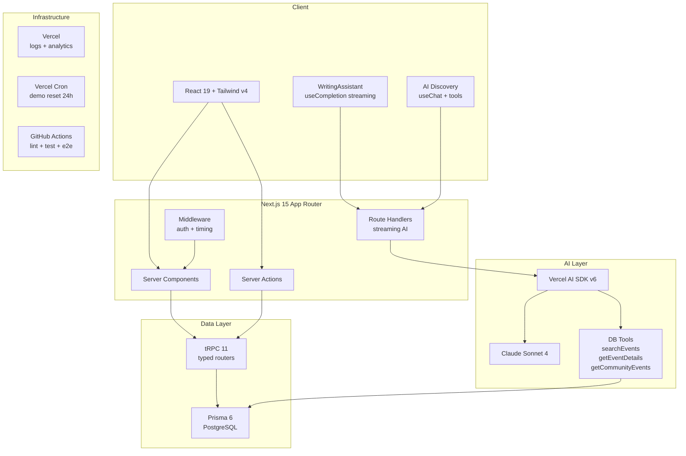

# RSVP'd

An AI-forward event management platform built with Next.js 15, tRPC, Prisma, and the Vercel AI SDK. Inspired by Lu.ma — with agentic AI event discovery that searches your database through typed tools.

## Architecture



## AI Architecture

The AI layer demonstrates three patterns using the Vercel AI SDK:

### 1. Structured Output (`generateObject`)
Server actions use `generateObject` with Zod schemas for type-safe AI responses. No manual JSON parsing — the SDK validates against the schema automatically.

```
Server Action → generateObject(schema) → Claude → typed response
```

### 2. Streaming Text (`streamText` + `useCompletion`)
The WritingAssistant streams text enhancements via a Route Handler. Text appears progressively instead of after a loading spinner.

```
WritingAssistant → POST /api/ai/enhance → streamText → progressive UI
```

### 3. Agentic Tool Use (`streamText` + tools + `useChat`)
The centerpiece: AI Event Discovery. The model calls typed database tools, reasons about results, and streams recommendations.

```
User query → POST /api/ai/discover → Claude calls tools:
  → searchEvents({ query, city?, category? }) → Prisma → results
  → getEventDetails({ eventId }) → Prisma → details
  → getCommunityEvents({ communityId }) → Prisma → events
Claude synthesizes → streaming response with event data
```

**Guardrails:** `stepCountIs(5)` max steps, 20 req/hr rate limit per user, graceful fallback on error, abort signal support.

## Tech Stack

| Layer | Technology | Version |
|---|---|---|
| Framework | Next.js (App Router, RSC) | 15.4 |
| Language | TypeScript (strict) | 5.x |
| UI | React 19 + ShadCN + Radix | 19.x |
| Styling | Tailwind CSS v4 (`@theme` tokens) | 4.1 |
| Database | Prisma → PostgreSQL | 6.11 |
| API | tRPC (server-side callers) | 11.x |
| AI | Vercel AI SDK + Claude (Anthropic) | 6.x |
| Auth | NextAuth v5 (Google OAuth + Credentials) | 5.0-beta |
| Testing | Vitest + Playwright | 4.x / 1.x |
| Observability | Vercel Logs + Analytics | built-in |
| CI/CD | GitHub Actions + Vercel | - |
| Linting | Biome | 2.1 |

## Considered and Rejected

| Option | Decision | Rationale |
|---|---|---|
| **Python for AI** | Rejected | Vercel AI SDK covers tool use, streaming, structured output in TypeScript. Python adds deployment complexity for zero benefit in this stack. |
| **Generic chatbot** | Rejected | Built domain-specific event discovery instead. The AI calls YOUR database through YOUR typed tools — more impressive than a wrapper around a chat API. |
| **Database sessions** | Rejected | JWT strategy is faster (no DB lookup per request). PrismaAdapter syncs OAuth accounts separately. |
| **100% test coverage** | Rejected | Behavior tests over coverage metrics. "HIGH spending users never get FREE tier" > "95% line coverage". |
| **Separate backend** | Rejected | Next.js Route Handlers + tRPC cover API needs. No Express/Fastify layer needed. |

## Getting Started

### Prerequisites
- Node.js >= 20
- Docker (for PostgreSQL)
- Yarn

### Setup

```bash
# Clone and install
yarn install

# Start database
docker compose up -d

# Configure environment
cp .env.example .env
# Set: DATABASE_URL, AUTH_SECRET, AUTH_GOOGLE_ID/SECRET, ANTHROPIC_API_KEY

# Setup database
yarn db:push          # Push schema
yarn db:seed          # Seed with LLM-generated data (600 users, 420 communities)

# Start dev server
yarn dev
```

### Commands

| Command | Description |
|---|---|
| `yarn dev` | Dev server (Turbopack) |
| `yarn build` | Production build |
| `yarn lint` | Biome lint + format (auto-fix) |
| `yarn type-check` | TypeScript strict check |
| `yarn test` | Run Vitest unit tests |
| `yarn test:coverage` | Tests with coverage report |
| `yarn db:push` | Push schema to DB |
| `yarn db:migrate` | Create + apply migration |
| `yarn db:seed` | Run 3-stage seed pipeline |
| `yarn db:studio` | Prisma Studio GUI |

### Demo User

Click "Try the Demo" on the login page to sign in as a pre-populated demo user with RSVPs, community memberships, and hosted events. Data resets every 24 hours via Vercel Cron.

## Project Structure

```
app/
  (auth)/           # Auth flows (login, register, profile)
  (main)/           # Protected routes (events, communities, stir)
  (static)/         # Public marketing pages (RSC only)
  api/ai/           # AI route handlers (enhance, discover)
  api/cron/         # Vercel Cron endpoints (demo reset)

server/
  api/routers/      # tRPC routers (event, community, rsvp, etc.)
  actions/          # Server Actions (auth, AI, events, RSVP)
  actions/ai/       # AI server actions + prompt templates

components/
  ui/               # ShadCN components (barrel export)
  shared/           # Reusable: Footer, WritingAssistant, etc.
  features/         # Feature-specific: AI Discovery

lib/
  ai/               # AI SDK provider + helpers
  auth/             # NextAuth v5 config (JWT enriched with role + isDemo)
  config/           # Routes, demo user, design tokens

prisma/
  schema.prisma     # Full schema (User, Event, Community, Order, etc.)
  seed/             # 3-stage LLM-powered seed pipeline
```

## Testing

- **Unit tests** (Vitest): Seed matching logic — 13 tests covering `findInterestedUsers`, `selectTierForUser`, `selectIntelligentAttendees`
- **Integration tests** (Vitest + Prisma): Event and community query validation
- **E2E tests** (Playwright): Homepage, login, discover page smoke tests
- **CI**: GitHub Actions runs lint, type-check, Vitest, Playwright on every PR
